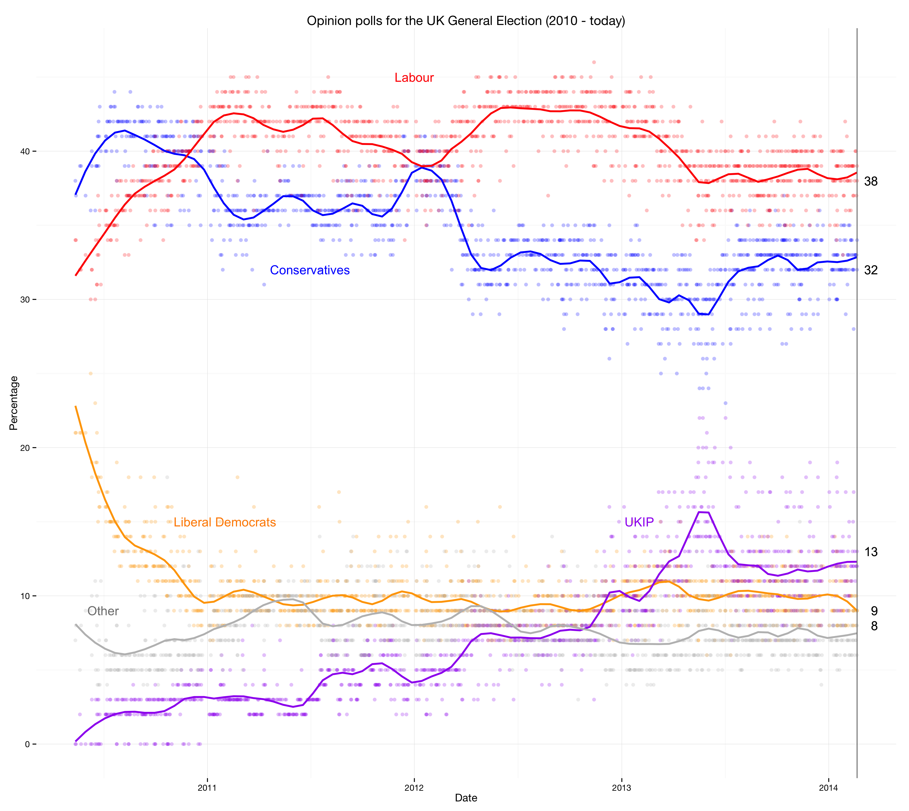
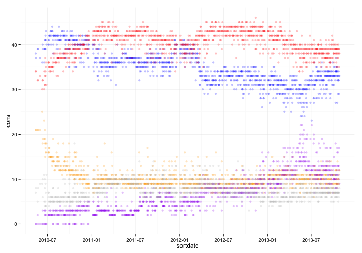
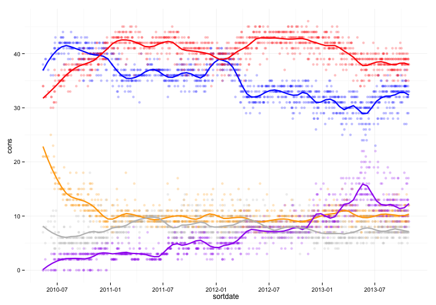
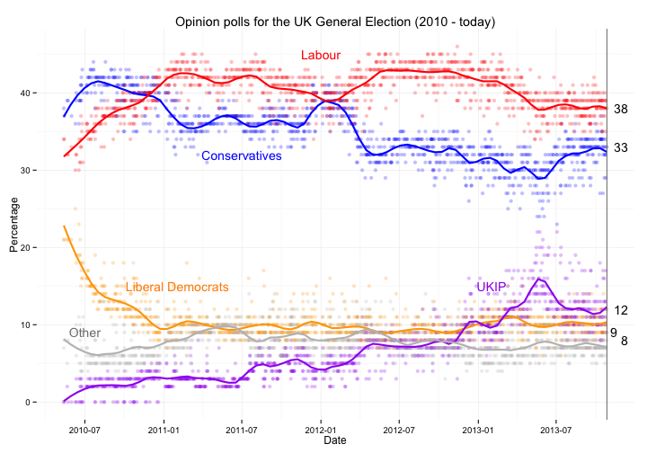

# Why public data is not the same as open data
-----
## A tutorial on how to import a HTML table into R



How popular are political parties in the UK outside general elections? Opinion polls tell us how people *would* vote. [Here](http://en.wikipedia.org/wiki/Opinion_polling_for_the_next_United_Kingdom_general_election) is some publicly available data. It is saved as multiple, unwieldy HTML tables. Despite its [Wikipedia Creative Commons Attribution-ShareAlike Licence](http://en.wikipedia.org/wiki/Wikipedia:Text_of_Creative_Commons_Attribution-ShareAlike_3.0_Unported_License) that makes it hard to use.

For example, can we recreate the plot of trends over time with a different smoothing function?

Solutions like [import.io](http://import.io/) or [scraperwiki](https://scraperwiki.com/) are very useful tools. Beyond converting the data into a useful format, we have a number of challenges:

* There are multiple HTML tables.
* Some rows *in the middle* are headers and not data.
* The date column contains date ranges, e.g. 21-22 Oct.
* The last column *Lead* also has characters as in "tied".
* And a number of minor fun inconsistencies such as the use of "–" (em dash) and "-" (en dash).

### Loading the data into R

We'll use the `XML` package for that. Let's also load two more packages. You may have to run `install.packages("XML", "stringr", "ggplot2")`.

```r
library(XML)
library(stringr)
library(ggplot2)
url <- "http://en.wikipedia.org/wiki/Opinion_polling_for_the_next_United_Kingdom_general_election"
```


Because the wikipedia site has 4 tables, we will use a function for it. All functions are at the bottom and based on `readHTMLTable()`. The `readlines` reads the URL, `which` is the table number, in `header` we specify the column names, and the last option avoids [factors](http://www.statmethods.net/input/datatypes.html).


```r
polls.raw <- readHTMLTable(readLines(url), which = 1, header = TRUE, stringsAsFactors = FALSE)
str(polls.raw)
```

```
## 'data.frame':	346 obs. of  9 variables:
##  $ Date(s)
## conducted         : chr  "31 Oct–1 Nov" "30–31 Oct" "30–31 Oct" "29–30 Oct" ...
##  $ Polling organisation/client: chr  "YouGov/Sunday Times" "Populus" "YouGov/The Sun" "YouGov/The Sun" ...
##  $ Sample size                : chr  "1,885" "2,015" "1,671" "1,862" ...
##  $ Cons                       : chr  "32%" "33%" "35%" "33%" ...
##  $ Lab                        : chr  "41%" "40%" "39%" "40%" ...
##  $ Lib Dem                    : chr  "8%" "11%" "9%" "8%" ...
##  $ UKIP                       : chr  "12%" "9%" "10%" "11%" ...
##  $ Others                     : chr  "7%" "7%" "7%" "8%" ...
##  $ Lead                       : chr  "9%" "7%" "4%" "7%" ...
```

There are several problems, which are all tackled in the function:
* The column names have whitespaces, replaced by a dot in `clean.names()`.
* Some rows are emtpy because subheaders, remove with `polls.raw[!is.na(x$sample.size), ]`
* Then we assign the correct class for the columns, i.e. factors for polling organisation, numeric for the results by removing the "%" and any characters such as "--" instead of 0. 
* We solve the "date range" problem by using the last day of the range in `end.rate`. Anything before the dash (or dash) is removed.
* We add the year for each table.

## The meat of the code

```r
# Need clean names for column headers
clean.names <- function(x) {
  y <- str_trim(colnames(x))
  y <- gsub("\\s", ".", y)
  y <- str_replace_all(y, "[[:punct:]]", ".")
  y <- tolower(y)
  return(y)
}

# Extract date from range for sorting by removing everything before the dash
# Such a mess to find the right "-" symbol 
# Opional \\s? for whitespace after dash not needed as in "30 May - 2 June"
end.date <- function(x, yr) {
  y  <- as.Date(paste(gsub(".+(–|-)", "", x), as.character(yr)), format = "%d %b %Y")
  return(y)
}

# Some lines are subheaders, remove
# Formats vary and sometimes include non-numeric
extract.tables <- function(url, num, year) {
  x <- readHTMLTable(readLines(url), which = num, header = TRUE, stringsAsFactors = FALSE)
  colnames(x) <- clean.names(x)
  x <- x[!is.na(x$sample.size), ]
  x[, "polling.organisation.client"] <- as.factor(str_trim(x[, "polling.organisation.client"]))
  x[, "sample.size"] <- as.numeric(gsub(",", "", x[, "sample.size"]))
    percent <- c("cons", "lab", "lib.dem", "ukip", "others")
  x[, percent] <- lapply(x[, percent], function(z) {as.numeric(sub("%", "", z))})
  x[x$lead == "Tied", "lead"]  <- 0
  x[is.na(x$ukip) == TRUE, "ukip"]  <- 0
  x[, "lead"] <- as.numeric(sub("%", "", x[, "lead"]))
  x[, "sortdate"] <- end.date(x[, "date.s..conducted"], year)
  x[, "year"] <- year
  return(x)
}
```


There are some warnings, but we already mentioned why.

```r
polls2013 <- extract.tables(url, 1, 2013)
polls2012 <- extract.tables(url, 2, 2012)
```

```
## Warning: NAs introduced by coercion
```

```r
polls2011 <- extract.tables(url, 3, 2011)
```

```
## Warning: NAs introduced by coercion
```

```r
polls2010 <- extract.tables(url, 4, 2010)
```

```
## Warning: NAs introduced by coercion
```

The last row of 2010 is strange; it's not a poll but the actual results.

```r
tail(polls2010, n = 1)
```

```
##     date.s..conducted        polling.organisation.client sample.size cons
## 175             6 May General Election Results (GB only)    29691380 36.9
##      lab lib.dem ukip others lead   sortdate year
## 175 29.7    23.6  3.1    6.7  7.2 2010-05-06 2010
```


We remove it and combine the four dataframes.

```r
# Exclude general election results
polls2010 <- polls2010[polls2010$sample.size < 2e+07, ]
polls <- rbind(polls2013, polls2012, polls2011, polls2010)

# Sort by date
polls <- polls[order(polls$sortdate), ]
```


## Now the fun part: visualising it.

First we visualise the polling results. We improve it by using a clean ggplot theme and slightly transparent markers.

```r
theme_set(theme_minimal())
p <- ggplot(polls, aes(x = sortdate)) + 
  geom_point(aes(y = cons), color = "blue", alpha = 1/4) + 
  geom_point(aes(y = lab), color = "red", alpha = 1/4) +
  geom_point(aes(y = lib.dem), color = "orange", alpha = 1/4) +
  geom_point(aes(y = ukip), color = "purple", alpha = 1/4) +
  geom_point(aes(y = others), color = "gray", alpha = 1/4)
p
```

 


Let's add the moving average. Because this is not D3, but a powerful statistical language we can specify the function and its parameters.

```r
p <- p + geom_smooth(aes(y = cons), color = "blue", se = FALSE, method = loess, span = 0.1, size = 1) + 
  geom_smooth(aes(y = lab), color = "red", se = FALSE, method = loess, span = 0.1, size = 1) + 
  geom_smooth(aes(y = lib.dem), color = "orange", se = FALSE, method = loess, span = 0.1, size = 1) + 
  geom_smooth(aes(y = ukip), color = "purple", se = FALSE, method = loess, span = 0.1, size = 1) + 
  geom_smooth(aes(y = others), color = "gray", se = FALSE, method = loess, span = 0.1, size = 1)
p
```

 


We're close to the chart on wikipedia. A good visualisations has the right labels next to the data and axes titles. It's a bit of fiddeling, but the results make it more readable.

```r
p <- p + ylab("Percentage") + xlab("Date") + ggtitle("Opinion polls for the UK General Election (2010 - today)") +
  annotate("text", x = as.Date("2011-07-01"), y = 32, label = "Conservatives", size = 5, color = "blue") + 
  annotate("text", x = as.Date("2012-01-01"), y = 45, label = "Labour", size = 5, color = "red") + 
  annotate("text", x = as.Date("2011-02-01"), y = 15, label = "Liberal Democrats", size = 5, color = "darkorange") +
  annotate("text", x = as.Date("2013-02-01"), y = 15, label = "UKIP", size = 5, color = "purple") + 
  annotate("text", x = as.Date("2010-07-01"), y = 9, label = "Other", size = 5, color = "grey50") 
p
```

 


Finally, let's add a few data labels that tell the story of the "state-of-the-nation" today. 


```r
# Could be improved by taking the average of the last few polls
today  <-  polls[polls$sortdate == max(polls$sortdate), c("cons", "lab", "lib.dem", "ukip", "others")]

p <- p + geom_vline(xintercept = as.numeric(max(polls$sortdate)), color = "grey50", size = 0.5) +
  geom_text(data = today, aes(x = max(polls$sortdate), y = today[1, "cons"], label = today[1, "cons"]), hjust = -0.5) +
  geom_text(data = today, aes(x = max(polls$sortdate), y = today[1, "lab"], label = today[1, "lab"]), hjust = -0.5) + 
  geom_text(data = today, aes(x = max(polls$sortdate), y = today[1, "lib.dem"], label = today[1, "lib.dem"]), hjust = -0.5) +
  geom_text(data = today, aes(x = max(polls$sortdate), y = today[1, "ukip"], label = today[1, "ukip"]), hjust = -0.5) +
  geom_text(data = today, aes(x = max(polls$sortdate), y = today[1, "others"], label = today[1, "others"]), hjust = -2)
p
```

 


## Take it from here

The data is now in a more open format. For example, you can download the cleaned csv-file from our [site](http://theodi.org) and open it in Excel.

Or you can use this code and run your own analysis, e.g.:
* Filtering the results by the polling organisations.
* Compute an average prediction by weighting different polling organisations given their trustworthiness.
* Add, update or improve the quality of the data.


